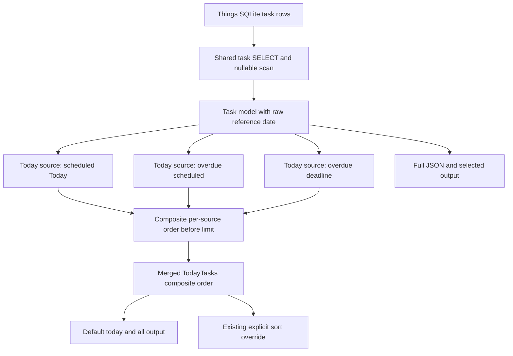

# Today Reference Order - Plan

## Goal Capsule

- **Objective:** Expose Things' nullable packed `todayIndexReferenceDate` value and make the default Today order reproduce the app's ordering as closely as the available database metadata allows.
- **Authority:** GitHub issue #36 and the confirmed scope in this plan override inferred implementation preferences; repository instructions and existing CLI contracts govern the remaining details.
- **Execution profile:** Pure read-path change across the shared task query, task output, Today ordering, fixtures, and documentation.
- **Stop conditions:** Stop if the current Things database or checked-in integration fixture lacks `todayIndexReferenceDate`, or if live evidence contradicts the proposed key order.
- **Tail ownership:** Finish with focused and full tests, a privacy-light live ordering comparison when permissions allow, synchronized Things skill guidance, and no unrelated Today pagination cleanup.

---

## Product Contract

### Summary

Expose the raw Today reference-date metadata in structured and selected task output, then order every default `TodayTasks` result by bucket, newest reference date, manual Today index, and a deterministic tie-breaker.

### Problem Frame

`things today` currently sorts the three merged Today result groups by `todayIndex` alone, with `startDate` as a fallback. Things treats `todayIndex` as meaningful only within a `todayIndexReferenceDate`, so values from different scheduling epochs cannot reproduce the app's visible order. PR #12 exposed `startBucket` but did not expose the other ordering key or use the complete ordering contract.

### Requirements

**Data exposure**

- R1. Task data exposes the nullable packed integer as `today_index_reference_date` without decoding or reformatting it.
- R2. Full JSON and JSONL include the field when present and omit it when absent, matching the existing `omitempty` task model convention.
- R3. Selected table, CSV, JSON, and JSONL output accepts the canonical field plus compact and hyphenated aliases; null renders as blank in text formats and `null` in selected structured output.

**Default Today behavior**

- R4. Default Today results sort by `start_bucket` ascending, `today_index_reference_date` descending, and `today_index` ascending.
- R5. Nullable values follow the SQLite ordering used by issue #36's evidence: null first for ascending bucket/index keys and null last for the descending reference-date key; UUID ascending provides deterministic ordering when all three keys tie.
- R6. The same ordering applies to direct `TodayTasks` consumers, including the Today section of `things all`.
- R7. Each source query uses an equivalent composite order before applying its branch limit so candidate rows are not discarded according to the obsolete `todayIndex`-only order.
- R8. An explicit supported `--sort` continues to override the default Today order.

**Compatibility and scope**

- R9. The change remains read-only and requires no Things schema migration or write-path behavior.
- R10. `today_index_reference_date` is not added to the generic `--sort` field registry in this change.

### Acceptance Examples

- AE1. Given a This Evening task with a newer reference date than a Today task, default output still places the Today task first because bucket order has precedence.
- AE2. Given two tasks in the same bucket with different reference dates, default output places the task with the newer reference date first regardless of raw Today index magnitude.
- AE3. Given two tasks in the same bucket and reference date, default output preserves manual order by placing the lower Today index first.
- AE4. Given missing ordering metadata, SQL source ordering and the Go merge comparator place nulls identically and retain deterministic UUID tie-breaking.
- AE5. Given `things today --sort title`, title order replaces the default app-like order.
- AE6. Given a null reference date, full task JSON omits the field while selected JSON emits the field with `null`.

### Scope Boundaries

In scope:

- Shared task model, SELECT/scan contract, nullable mapping, and source-created SQLite fixtures.
- Selected and full structured output behavior.
- Per-source and merged Today ordering, including inherited `things all` behavior.
- User-facing command documentation and synchronized agent guidance.

#### Deferred to Follow-Up Work

- Add `today_index_reference_date` to generic `--sort` parsing and SQL/post-fetch comparators only when a consumer requires that public sort field.
- Correct the pre-existing behavior where the default Today limit is applied independently to three source queries and the merged result is not re-limited.

Outside scope:

- Decode the packed integer into a calendar date.
- Write, migrate, or repair Things database values.
- Promise exact reconstruction after manual drags that update `todayIndex` without updating the reference date.

### Sources

- GitHub issue #36 defines the missing field and observed app ordering.
- GitHub PR #12 and commit `a380e2f` provide the closest model/query/output/fixture precedent for `start_bucket`.
- `internal/db/queries.go` contains the shared positional SELECT/scan contract and final Today merge sort.
- `internal/cli/taskoutput.go` contains selectable task-field aliases and format-specific null rendering.

---

## Planning Contract

### Key Technical Decisions

- KTD1. **Keep the raw nullable integer.** Model the private Things column as `*int`, mirroring `TodayIndex` and `StartBucket`, because consumers need ordering fidelity rather than a derived date representation.
- KTD2. **Extend the shared query contract once.** Add the column beside `todayIndex` in the shared SELECT, nullable scan state, positional `Scan`, and model assignment so every task read surface receives consistent data.
- KTD3. **Use one ordering contract at both selection stages.** Give all three source queries the composite SQL order before their branch limits, then repeat the same comparison after merging to establish a global order across sources.
- KTD4. **Match the evidenced SQLite null semantics.** The Go comparator must reproduce SQLite's native null placement for the three requested sort directions rather than inventing a nil-last policy; nil remains distinct from zero.
- KTD5. **Centralize behavior in `TodayTasks`.** This keeps `things today`, `things all`, and direct Store consumers consistent while preserving CLI post-sorting for explicit `--sort` requests.
- KTD6. **Do not widen generic sorting.** Output selection and default Today ordering solve issue #36 without adding a new `--sort` contract across both SQL and Go sorting registries.

### High-Level Technical Design

The SQL and Go orderings are two representations of the same contract. Tests should compare observable order rather than locking implementation to a particular helper name or SQL expression shape.

### Risks and Dependencies

- The shared positional SELECT/scan list is sensitive to column misalignment; DB tests must prove both non-null and null mapping.
- `todayIndexReferenceDate` is a private Things schema column. This project targets the current Things database shape and already relies on private columns without version negotiation; implementation must verify the checked-in fixture and should also verify a current live database when Things and permissions are available rather than add capability detection.
- Go's pointer comparisons must be tested against SQLite's native null ordering so the branch-level and merged orders do not diverge.
- The integration fixture database may already carry the private column; inspect its schema before deciding whether the binary fixture needs modification.

### Sequencing

U1 establishes the field and fixture compatibility. U2 and U3 can then build independently on the model contract. U4 follows the behavior and output decisions. U5 syncs the external skill mirror from an isolated `agent-scripts` worktree after U4 finalizes the wording.

---

## Implementation Units

### U1. Extend the shared task data contract

- **Goal:** Read and model `todayIndexReferenceDate` safely across every shared task-query fixture.
- **Requirements:** R1, R2, R9
- **Dependencies:** None
- **Files:** `internal/db/models.go`, `internal/db/queries.go`, `internal/db/queries_test.go`, `internal/db/lists_test.go`, `internal/db/today_test.go`, `internal/cli/dbtest_helpers_test.go`, `integration/db_helpers_test.go`, and `integration/fixtures/main.sqlite` only if schema inspection proves it necessary.
- **Approach:** Follow PR #12's nullable integer pattern and keep the SELECT, scan destinations, and post-scan assignments positionally aligned. Add the column to every source-created `TMTask` schema that reaches the shared query path.
- **Patterns to follow:** `StartBucket` and `TodayIndex` in the task model and shared query scanner.
- **Test scenarios:**
  1. A non-null packed reference date is scanned without conversion and appears on the task model.
  2. A SQL NULL becomes a nil task field rather than zero.
  3. Existing list and generic task queries continue scanning correctly after the positional SELECT changes.
  4. Every relevant in-memory and integration schema supports the shared SELECT.
- **Verification:** Focused DB and fixture-backed tests pass without scan-count, missing-column, or shifted-field failures.

### U2. Expose the field through task output

- **Goal:** Make the raw reference date available through full structured output and `--select` without changing default table columns.
- **Requirements:** R1, R2, R3, R10, AE6
- **Dependencies:** U1
- **Files:** `internal/cli/taskoutput.go`, `internal/cli/taskoutput_test.go`, `integration/tasks_json_test.go`
- **Approach:** Mirror `today_index` field normalization, headers, typed value extraction, and text conversion. Preserve the distinction between omitted nil fields in full struct JSON and explicit nulls in selected JSON.
- **Patterns to follow:** `start_bucket` and `today_index` aliases and rendering paths in `internal/cli/taskoutput.go`.
- **Test scenarios:**
  1. Canonical, compact, and hyphenated names normalize to the same selected field.
  2. Selected table and CSV output show the raw integer with the expected header and leave nil blank.
  3. Selected JSON and JSONL emit a number for present data and `null` for nil.
  4. Full JSON and JSONL include a present field and omit a nil field.
  5. The default table field set remains unchanged.
- **Verification:** Output tests prove consistent values and null behavior across supported formats, and CLI integration proves the field is reachable from a fixture-backed command.

### U3. Reproduce the app-like default Today order

- **Goal:** Apply the complete ordering contract before source limits and after merging while retaining explicit sort overrides.
- **Requirements:** R4, R5, R6, R7, R8, AE1, AE2, AE3, AE4, AE5
- **Dependencies:** U1
- **Files:** `internal/db/queries.go`, `internal/db/today_test.go`, `integration/list_commands_test.go`
- **Execution note:** Start with ordering scenarios that fail under the current `todayIndex`-only comparator, including a branch-limit case, before changing query or merge behavior.
- **Approach:** Define equivalent SQL and Go lexicographic ordering with per-key null handling that matches SQLite: null first for ascending bucket/index keys and null last for the descending reference-date key. Keep the behavior in `Store.TodayTasks`; use UUID only as the final deterministic tie-breaker.
- **Patterns to follow:** The existing three-query merge in `TodayTasks` and the CLI's established post-fetch override path for explicit sorts.
- **Test scenarios:**
  1. Today bucket rows precede This Evening rows even when later keys favor the Evening row.
  2. Newer reference dates precede older dates within one bucket.
  3. Lower Today indexes precede higher indexes within one bucket and reference date.
  4. Nil bucket, reference date, and Today index match SQLite's placement for their respective directions without treating nil as zero.
  5. Equal composite keys use UUID ascending for stable results.
  6. More candidates than a branch limit retain the best rows under the new composite order.
  7. `things all` inherits the same order in its Today section.
  8. A supported explicit `--sort`, such as title, overrides the default order.
- **Verification:** Store-level and CLI integration assertions agree on the composite order and demonstrate the override path.

### U4. Document the exposed field and ordering behavior

- **Goal:** Describe the new read field, default Today semantics, and their limits wherever users and agents discover the CLI.
- **Requirements:** R1, R4, R8, R10
- **Dependencies:** U2, U3
- **Files:** `README.md`, `doc/man/things.1.md`, `share/man/man1/things.1`, `skills/things/SKILL.md`
- **Approach:** State that default Today output follows bucket/reference-date/index order, the selected field is a raw packed integer, and generic sorting by that field is not supported.
- **Patterns to follow:** Existing Today command descriptions and the output-field guidance in the Things skill.
- **Test expectation:** No new behavioral test belongs to documentation-only changes; generated man-page consistency and exact skill-mirror parity are verification concerns.
- **Verification:** User docs and the in-repo skill agree with the implemented command behavior, and generated man output matches its source.

### U5. Synchronize the external Things skill mirror

- **Goal:** Land the same agent-facing guidance in `agent-scripts` without mixing its existing local changes into this repository's branch.
- **Requirements:** R1, R4, R8, R10
- **Dependencies:** U4
- **Files:** In the secondary `agent-scripts` repository, `skills/things/SKILL.md`.
- **Approach:** Create an isolated worktree from `agent-scripts` `origin/main`, copy the finalized guidance from the in-repo skill, commit only that skill file, and open a separate PR. Do not touch the user's dirty primary `agent-scripts` checkout.
- **Patterns to follow:** Preserve the active global skill location; the repository instruction's archived path is stale and must not be recreated.
- **Test expectation:** No behavioral tests apply; exact guidance parity and a clean isolated diff are the contract.
- **Verification:** The secondary PR contains only the intended Things skill update and links back to the primary behavior PR.

---

## Verification Contract

| Gate | Applies to | Done signal |
|---|---|---|
| `gofmt` on changed Go files | U1-U3 | No formatting diff remains. |
| `go test ./internal/db ./internal/cli` | U1-U3 | Model, scan, output, and ordering scenarios pass. |
| `go test ./integration` | U1-U3 | Fixture-backed output, Today, All, and explicit-sort flows pass. |
| `go test ./...` or `make test` | All units | The complete repository suite passes. |
| `make build` | All units | `bin/things` builds successfully. |
| Privacy-light live smoke test | U1-U3 | With Things and Full Disk Access available, `things today --select uuid,start_bucket,today_index_reference_date,today_index` matches the app-visible ordering for sampled rows; otherwise the PR notes why live proof was skipped. |
| Documentation parity | U4 | Man source/generated output and the in-repo Things skill agree. |
| Cross-repository skill sync | U5 | A separate `agent-scripts` PR updates only `skills/things/SKILL.md` from an isolated worktree. |

---

## Definition of Done

- The task model and every shared query path expose the nullable raw reference date without positional scan regressions.
- Selected and full structured output follow the specified present/null behavior.
- Default `TodayTasks`, `things today`, and the Today section of `things all` use the same composite, SQLite-consistent, deterministic order.
- Per-source ordering protects branch-limited candidate selection, while explicit supported `--sort` still overrides the default.
- Focused, integration, full-suite, build, and documentation parity gates pass, and the external skill sync is opened as its own clean PR.
- Live Things verification is recorded, or its permission/environment blocker is stated in the PR testing notes.
- No generic reference-date sort field, packed-date decoding, write path, migration, Today limit refactor, or abandoned experimental code remains in the diff.
